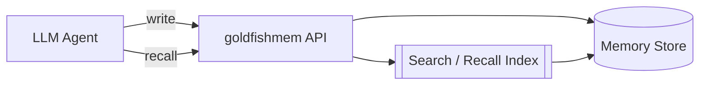
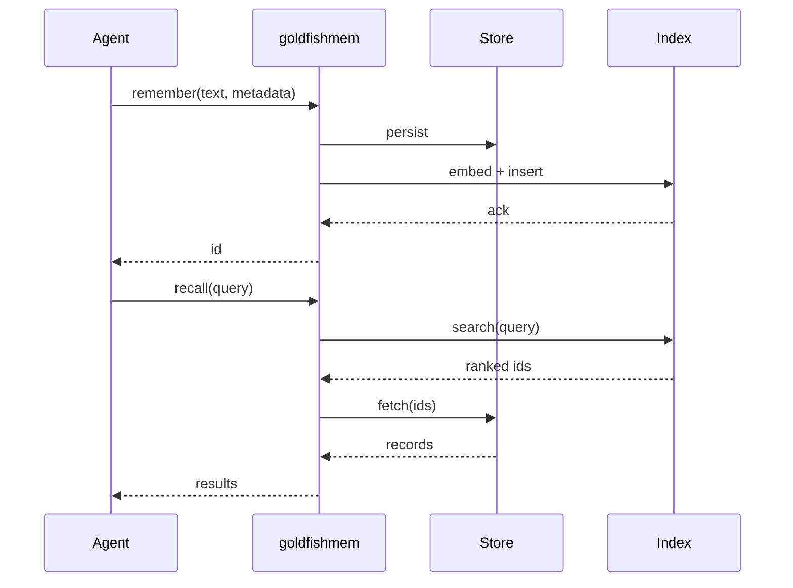

# Architecture

This page describes the high-level architecture of goldfish. Diagrams are
written in [mermaid](https://mermaid.js.org/) so they render inline on GitHub.

> The project is in its earliest stage — this page currently shows the intended
> shape of the system as a placeholder. Concrete components will land here as
> they are built and merged.

## High-level shape

## Lifecycle of a memory

## Where to read next

- The package source lives under [`goldfishmem/`](https://github.com/MadaraUchiha-314/goldfish/tree/main/goldfishmem).
- Test layout: [`tests/unit/`](https://github.com/MadaraUchiha-314/goldfish/tree/main/tests/unit) and [`tests/integration/`](https://github.com/MadaraUchiha-314/goldfish/tree/main/tests/integration).
