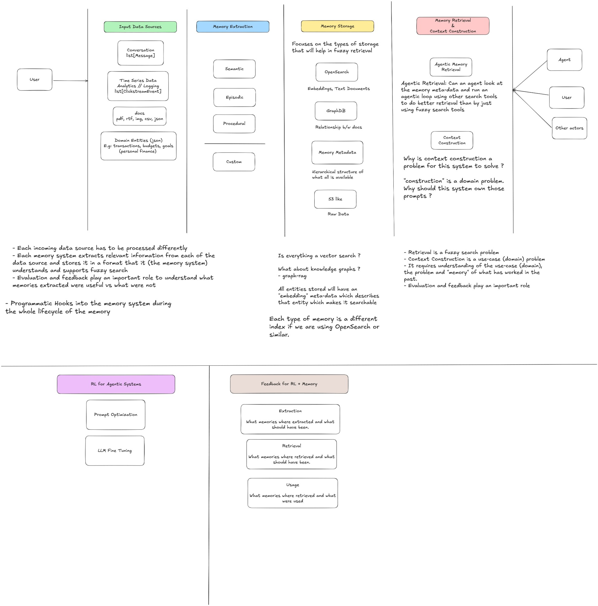

# goldfishmem — Product Requirements Document (Initial)

> Status: **Initial draft**. This document is the starting point for project
> planning. Task breakdown, milestones, and implementation decisions are tracked
> separately on the GitHub Project.

## 1. Glossary

- **User** — usually the submitter of a task, who either wants the agent to
  complete the task (autonomous mode) or work with an agent to complete the task
  (assistive mode).
- **Task** — a unit of work submitted to either an agent or human executor.
- **Executor** — an agent or human that is executing a task that requires memory.
- **Interaction** — an event between a user and the product (a message, a
  clickstream event, an uploaded document, a domain event, etc.) that the memory
  system can learn from.
- **Memory** — a derived, persisted unit of knowledge extracted from one or more
  interactions, intended to aid future task execution.
- **Context** — any piece of information that affects how well a task can be
  performed by its executor.
- **Context Construction** — the act of assembling the right context for a given
  task at execution time.

## 2. Motivation

Agents and humans need the appropriate context when they perform a task. Context
construction is the responsibility of the executor — the executor knows the most
about the task it is executing. However, context construction can be a
computationally expensive operation, because the right context may involve
interactions the user has had with the product at various points in their usage.

**Memory** is a system which serves as a critical component in context
construction by **pre-computing context and pre-computing insights as data comes
in**. This makes context construction a fast operation, because most derivations
are done up front during memory extraction and storage.

`goldfishmem` is intended to be a production-grade memory system for agents.

## 3. Architecture Overview

The system is organised into four pipeline stages plus two cross-cutting concerns
(feedback and self-improvement). The diagram below summarises the design:



> The source of truth for the diagram is
> [`docs/images/architecture.excalidraw`](images/architecture.excalidraw). The
> rendered preview `architecture.jpg` is regenerated from that source by
> exporting from [excalidraw.com](https://excalidraw.com) (File → Export → JPG).
> Update both files together when the diagram changes.

The stages are:

1. **Input Data Sources** — heterogeneous incoming data.
2. **Memory Extraction** — typed extraction of memories from observations.
3. **Memory Storage** — multi-modal storage optimised for fuzzy retrieval.
4. **Memory Retrieval & Context Construction** — agentic retrieval over the
   stored memories, with optional assistance for context construction.

Cross-cutting:

- **Feedback for RL + Memory** — extraction, retrieval, and usage feedback.
- **RL for Agentic Systems** — prompt optimisation and LLM fine-tuning informed
  by feedback.

## 4. Input Data Sources

Each incoming data source is processed differently, but all sources are
normalised into a common internal observation type before extraction. The
reference set of sources the system must support:

- **Conversation** — `list[Message]`.
- **Time series / analytics / logging** — `list[ClickstreamEvent]` and similar
  event streams.
- **Documents** — `pdf`, `rtf`, `img`, `csv`, `json`, etc.
- **Domain entities** — structured JSON objects (e.g. for a personal-finance
  use case: transactions, budgets, goals).

### Domain data

Domain data plays a big role in the memory system. It contains valuable
information about the user and is necessary for the memory system to derive
useful insights. For example, in a personal-finance scenario, information about
budgets, transactions, and goals must all be fed into memory so that appropriate
insights can be derived alongside other data sources.

### Notes from the architecture diagram

- Each memory system extracts relevant information from each data source and
  stores it in a format that supports fuzzy search.
- Evaluation and feedback play an important role in understanding which
  extracted memories were useful and which were not.
- Programmatic hooks into the memory system are required across the entire
  memory lifecycle (see §5).

## 5. Memory Extraction

Memory extraction is performed by a **memory generation agent**. The agent runs
a lifecycle composed of programmatic hooks combined with an LLM call whose
prompt extracts memories from the input observations.

### Lifecycle

```
process_interactions(interactions: list[Interaction])
  ├── before_extract_memories()   # hook
  ├── extract_memories()          # LLM call
  ├── after_extract_memories()    # hook
  ├── reflect()
  └── write_memories()
```

- The memory generation agent has access to tools that allow it to view
  existing memories.
- The agent may also be given other tools that let it access domain data, to
  aid in memory generation.

### Memory types

Extracted memories are typed. The taxonomy:

- **Semantic** — facts and conceptual knowledge.
- **Episodic** — specific past events and experiences.
- **Procedural** — preferences, behaviour patterns, and "how-to" knowledge.
- **Custom** — extension point for domain-specific memory types.

A memory must be searchable given a natural-language or fuzzy query.

## 6. Memory Storage

Memory storage focuses on the types of storage that support fuzzy retrieval. A
single storage layer is insufficient; the system uses several complementary
stores:

- **Vector / search store (e.g. OpenSearch)** — holds embeddings and text
  documents representing each memory and entity. Supports both semantic and
  BM25 keyword search.
- **Graph store (e.g. GraphDB)** — holds relationships between memory entities.
  The graph store must be performant; the choice of graph database is an open
  decision.
- **Memory metadata store** — maintains a hierarchical "table of contents" of
  all memories. This aids generation, organisation, and (most importantly)
  retrieval.
- **Raw data store (S3-like)** — stores the original, un-processed input data
  (documents, audio, full conversations, raw event payloads). Memories carry
  references back to their sources here.

### Cross-cutting storage notes

- All entities stored will have an **embedding metadata** field that describes
  the entity and makes it searchable.
- Each **memory type** corresponds to a separate index when using OpenSearch or
  a similar store.
- Retrieval must be able to fan across all three search-oriented stores
  (vector, hierarchy, graph).

### Open questions on storage

- *Is everything a vector search?* — probably not; we expect BM25 + graph
  traversal + hierarchy walks to all play a role.
- *What about knowledge graphs?* — graph-RAG style retrieval is in scope.

## 7. Memory Retrieval and Context Construction

### Agentic memory retrieval

Given a task that the executor is working on, the retrieval subsystem must find
all memories relevant to that task. The retrieval surface is an **agent**, not
a single vector lookup: it can look at the memory metadata (the hierarchical
TOC), traverse the knowledge graph, and run a loop using multiple search tools
to do better retrieval than fuzzy search alone.

### Context construction

Context construction is a use-case (domain) problem. It requires understanding
of the domain, the task, and the "memory" of what has worked in the past.
Retrieval is a fuzzy search problem; context construction is not.

> **Open question:** *"Construction" is a domain problem — why should this
> system own those prompts?* Whether context construction belongs inside
> `goldfishmem` (as an opinionated helper) or strictly outside it (with the
> system returning only ranked memories and provenance) is an unresolved
> architectural question for v1.

### Consumers

The retrieval surface is intended to be consumed by **agents**, **users
directly**, and **other actors** (services, batch jobs, etc.).

## 8. Feedback Loop

The memory system takes feedback on three things:

1. **Extraction** — what memories were extracted? What memories would have been
   extracted by an "ideal" system?
2. **Retrieval (during search)** — what memories were retrieved? What memories
   would have been retrieved by an "ideal" system?
3. **Usage (by the requestor)** — of the memories returned, which were actually
   used by the requestor?

The system must define how it ingests these feedback signals and how it
improves itself continuously.

## 9. Self-improvement (RL for Agentic Systems)

**Opinion (to be challenged):** in any agentic system, only two variables are
under our control:

- The **prompt**.
- The **LLM weights**.

So the only ways to improve the system are prompt optimisation and LLM
fine-tuning.

> **Open question:** challenge this opinion. Are there other levers — retrieval
> policy, index structure, tool design, ranking heuristics — that we should
> treat as tunable in the self-improvement loop?

The two named techniques in scope today:

- **Prompt Optimisation.**
- **LLM Fine Tuning.**

The design of the self-improvement layer is intentionally deferred, but the
architecture of the rest of the system must leave room for it.

## 10. API Design

- Design the API for the memory system defined above and produce an **OpenAPI
  spec**.
- The feedback layer and self-improvement layer will be designed later; the API
  surface must account for those architecture blocks even when their
  implementation is deferred.

## 11. Service Design

- Produce an end-to-end detailed service design.
- The design must cover both high-level and low-level concerns.
- Low-level details must include specifics on storage, incoming data, and the
  processing of incoming data.

## 12. Benchmarking

- Identify the benchmarks that are meaningful for a memory system.
- Set up a benchmarking process so that this memory system can be evaluated
  against those benchmarks and the results can be published.

## 13. Visualisation tool

We need a visualisation tool to make the memory system inspectable. It must
allow us to:

- Look at memories that were **created**.
- Look at memories that were **retrieved**.
- See the **memory agent trace**:
  - The actions taken by the memory agent when a new interaction arrives.
  - The actions taken by the memory agent when a task request comes in and
    memory is requested for that task.

> **Open question:** can we just use Langfuse (or a similar agent observability
> tool) for the trace portion, and build a thin custom UI only for the
> memory-specific inspector views?

## 14. Open questions (summary)

The following items are explicitly unresolved in this initial PRD and will be
decided during planning:

1. Choice of graph database.
2. Whether context construction belongs inside `goldfishmem` or strictly
   outside it.
3. Whether prompt + weights are the only tunable variables for self-improvement.
4. Whether Langfuse (or similar) is sufficient for agent-trace visualisation.
5. Concrete benchmark selection (LongMemEval, LoCoMo, custom, etc.).
